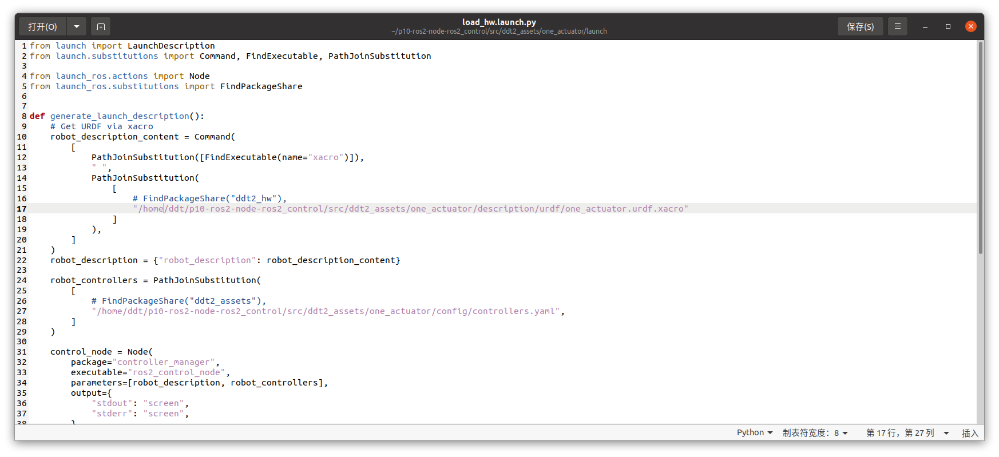
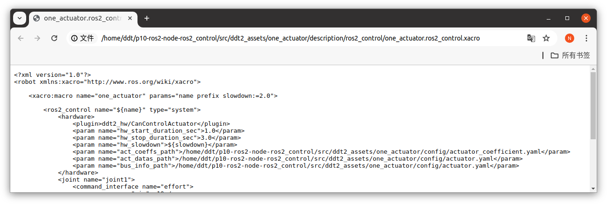

## DDT2_HW

#### 相关配置

##### 硬件

| 类别      | 型号               |
|---------|------------------|
| USB2CAN | MKS CANable V2.0 |
| 关节电机    | DDT P10 48V      |

##### 软件环境

| 主要环境         | 版本    |
|--------------|-------|
| Ubuntu       | 20.04 |
| ROS2         | foxy  |
| ros2_control | foxy  |

#### 项目介绍
- 利用ros2_control框架https://github.com/ros-controls/ros2_control/tree/foxy 实现硬件抽象层HAL。
- 利用Linux socketcan实现can信号的收发

#### 配置环境 
- 用户可以使用提前准备好的镜像，直接sd卡烧录即可，不需要额外准备horizonX3pi的ros2 环境
- 对于x3pi用户也可以手动配置环境


##### 通过镜像自动配置
即可跳过配置环境的步骤


##### 手动配置环境


##### 安装编译相关工具
```
sudo apt update 
sudo apt upgrade
sudo apt install -y \
  build-essential \
  cmake \
  git \
  python3-colcon-common-extensions \
  python3-pip \
  python3-vcstool \
  wget
```

###### 安装ros2_control
```
sudo apt-get install ros-foxy-ros2-control
sudo apt-get install ros-foxy-ros2-controllers
```

##### 相关依赖

```
sudo apt-get install ros-foxy-ament-cmake 
sudo apt install -y ros-foxy-control-toolbox
sudo apt-get install ros-foxy-yaml-cpp-vendor
sudo apt-get install xacro
```
##### 选择一个文件夹安装yaml-cpp工具包
```
mkdir yaml-cpp-share
git clone https://github.com/jbeder/yaml-cpp.git 
cd yaml-cpp && mkdir build && cd build
cmake -DYAML_BUILD_SHARED_LIBS=on ../yaml-cpp
sudo make
sudo make install
sudo ldconfig
```

##### 安装socketcan工具
```
sudo apt-get install can-utils
```


##### 依赖可视化工具
```
sudo apt-get install ros-foxy-plotjuggler*
sudo apt-get install ros-foxy-rqt*
```


##### 下载源码

```
cd ~
mkdir ddt2_hw
cd ddt2_hw
git clone -b horizonX3 https://github.com/DDTRobot/p10-ros2-node.git
colcon build --cmake-args -DCMAKE_EXPORT_COMPILE_COMMANDS=ON 
```


#### 源码介绍

- ddt2_assets：存放机器人（电机）相关配置，如控制器配置，urdf，launch
    - config：ros2_control框架下controller的配置
    - description：
        - ros2_control：urdf的<ros2_control>-tag xacro标签
        - urdf：urdf.xacro文件
    - launch：用launch.py来加载相关ros节点
- ddt2_controller：存放自定义的ros2_control的控制器，通过plugins以插件的形式给ros2_control使用
- ddt2_hw：实现底层的can数据的收发
- ddt2_msgs：用于在ddt2_controller中发布电机的相关信息

#### 使用

##### 更改文件路径
- launch文件中：xacro的路径

- description文件中:配置文件yaml的路径



##### 初始化MKS CANable V2.0的设置

```
ls /dev | grep ttyACM                         查看USB2CAN工具生成的设备,例如ttyACM0
sudo slcand -o -c -s8 /dev/ttyACMx can0       注意波特率要1M适配电机（-s8),换ttyACM中x为本机
sudo ifconfig can0 up
```


##### 开启控制器

```
source ~ddt2_ws/install/local_setup.bash
//注意：程序启动后，默认先控制电机回原点
ros2 launch ddt2_assets load_hw.launch.py
```

如果正常则会生成以下topic

```
/actuator_states
/ddt2_controller/commands
/ddt2_position_controller/velocity_limits_position
/dynamic_joint_states
/gains/joint1/pid_state
/joint_states
/parameter_events
/robot_description
/rosout
/tf
/tf_static
```

##### 提供bash脚本为开机自启动
```
#!/bin/bash
while true; do
    if ls /dev |grep -q "ttyACM0"; then 
        echo "USB-CAN device detectd, starting progame"
        break
    else 
        echo "waiting USB-CAN"
        sleep 1
    fi
done

#地平线X3pi需要，其他平台不一定
sudo setcap -r /usr/lib/python3.8
#根据计算机环境决定是否设置环境变量（.bashrc中）
export PATH=/opt/ros/foxy/bin:/usr/local/sbin:/usr/local/bin:/usr/sbin:/usr/bin:/sbin:/bin:/usr/games:/usr/local/games:/snap/bin

source /opt/ros/foxy/setup.bash 
//根据计算机路径需改变
source /home/ddt/p10-ros2-node-ros2_control/install/local_setup.bash

sleep 1
sudo slcand -o -c -s8 /dev/ttyACM0 can0
sleep 1
sudo ifconfig can0 up
sleep 1
ros2 launch ddt2_assets load_hw.launch.py

```


##### 控制电机

往`/ddt2_controller/commands`上发命令则可以控制(单位为圈，相对于位置零点），例如：

```
ros2 topic pub /ddt2_position_controller/commands std_msgs/msg/Float64MultiArray "{data: [1.5]}"
```

如果需要以指定速度到达指定位置的效果：data[0]:规划速度，data[1]：最终输出轴位置

```
ros2 topic pub /ddt2_position_controller/velocity_limits_position std_msgs/msg/Float64MultiArray "{data: [50,0.15]}"
```

##### 电机信息可视化

> 利用plotjuggler来看ros topic信息

```
ros2 run plotjuggler plotjuggler
```

`/joint_states`：电机信息的effort,position,velocity

`/actuator_states`：电机的一般信息加电机can信号中的原始信息


##### 电机参数修改

目前代码中默认电机can接在can0上，can id为51，如果需要修改

则在ddt2_assets的actuator.yaml中修改


##### 电机零点修改

1.在电机上电，失能时（上电默认失能），用手将电机转到期望零点位置

2.读取当前位置

```
cansend can0 035#0400000000000000
```

会在can0上时收到如下反馈

```
can0  071   [8]  16 F2 FF FF FF FF FF FF
```

其中数据位的前4位（16F2）位是电机位置

```
建议使用candump can0 | grep 071来获取该信息
```

3.在ddt2_assets/one_actuator/config/actuator_coefficient.yaml中修改第九行`pos_offset`为2步获取的值(注意不要带空格)
